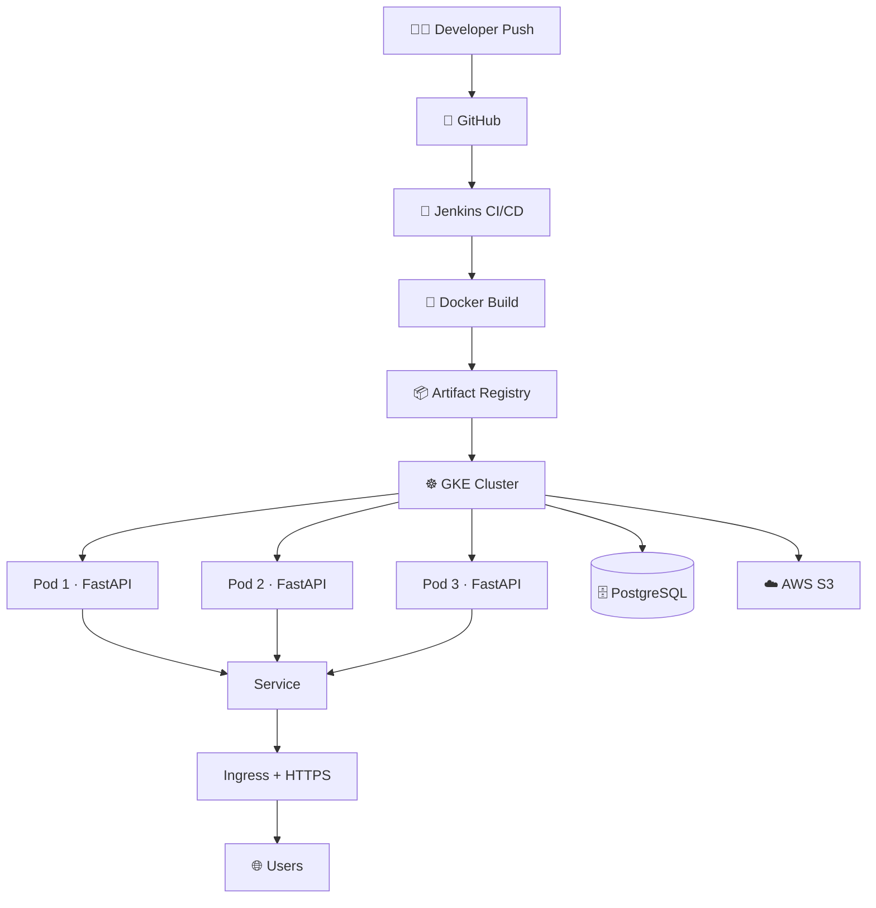

<<<<<<< HEAD
=======
<div align="center">


<br/>

[](https://www.python.org/)
[](https://fastapi.tiangolo.com/)
[](https://www.docker.com/)
[](https://kubernetes.io/)
[](https://www.jenkins.io/)
[](https://cloud.google.com/kubernetes-engine)

<br/>


</div>

<br/>

## ✨ Overview

**Fast Blog API** is a full-stack blog application built with **FastAPI** and **PostgreSQL**, containerized with **Docker**, and deployed through a **Jenkins CI/CD pipeline** to **Google Kubernetes Engine (GKE)**.

It traces the complete journey from source code to a cloud-hosted, self-healing application — an end-to-end DevOps build, not just a coding exercise.

<br/>

## 📑 Table of Contents

<div align="center">

[Highlights](#-highlights) • [Architecture](#️-architecture) • [Tech Stack](#-tech-stack) • [CI/CD Pipeline](#-cicd-pipeline) • [Kubernetes](#️-kubernetes) • [Config & Security](#-configuration--security) • [Structure](#-project-structure) • [Getting Started](#-getting-started) • [API Docs](#-api-documentation) • [Takeaways](#-devops-takeaways) • [Author](#-author)

</div>

<br/>

## 🎯 Highlights

<div align="center">

| | | |
|:---:|:---|:---|
| 🔐 | **Auth** | JWT authentication and authorization |
| 📝 | **Blog CRUD** | Create, update, and delete blog posts |
| 👤 | **Profiles** | User profiles and password reset |
| 🖼️ | **Media** | Profile picture uploads via AWS S3 |
| 🗄️ | **Database** | PostgreSQL with SQLAlchemy ORM |
| 🔄 | **Migrations** | Alembic-managed schema changes |
| 🐳 | **Containerized** | Fully Dockerized application |
| 🔧 | **CI/CD** | Automated Jenkins pipeline |
| 📦 | **Registry** | Google Artifact Registry |
| ☸️ | **Orchestration** | Kubernetes deployment on GKE |
| 🔁 | **Resilience** | Multi-replica, self-healing pods |
| 🌐 | **Networking** | Service + Ingress routing |
| 🔒 | **HTTPS** | Google-managed SSL certificate |
| 📊 | **Observability** | New Relic APM monitoring |

</div>

<br/>

## 🏗️ Architecture

<div align="center">



</div>

<br/>

## 🧰 Tech Stack

<div align="center">


</div>

<br/>

| Layer | Technologies |
|---|---|
| **Backend** | Python, FastAPI, Pydantic, SQLAlchemy |
| **Database** | PostgreSQL, SQL |
| **Authentication** | JWT, OAuth2 Bearer |
| **Storage** | AWS S3 |
| **Migrations** | Alembic |
| **Templates** | Jinja2 |
| **Containerization** | Docker |
| **CI/CD** | Jenkins |
| **Registry** | Google Artifact Registry |
| **Orchestration** | Kubernetes, GKE |
| **Networking** | Service, Ingress, DNS, HTTP/HTTPS |
| **Monitoring** | New Relic APM |
| **Cloud** | Google Cloud, AWS |

<br/>

## 🔄 CI/CD Pipeline

```
1. Developer pushes code
2. Jenkins checks out the repository
3. Docker image is built
4. Image is pushed to Artifact Registry
5. Jenkins applies Kubernetes manifests
6. GKE pulls the new image
7. Deployment rolls out updated Pods
8. Ingress exposes the application over HTTPS
```

```bash
kubectl apply -f k8s/deployment.yaml
kubectl apply -f k8s/service.yaml
kubectl apply -f k8s/ingress.yaml
```

<br/>

## ☸️ Kubernetes

The application runs behind a Kubernetes Service with multiple replicas:

```
                 Ingress
                    │
                    ▼
               Service :80
                    │
          ┌─────────┼─────────┐
          ▼         ▼         ▼
        Pod 1     Pod 2     Pod 3
        :8080     :8080     :8080
```

### 🔁 Self-Healing in Action

```
3 replicas desired

Pod 1 ✅
Pod 2 ❌  → Kubernetes recreates it automatically
Pod 3 ✅

Result → 3 healthy replicas maintained
```

This demonstrates declarative configuration, replica management, service discovery, and self-healing — core Kubernetes primitives in practice.

<br/>

## 🔐 Configuration & Security

Sensitive values are supplied through environment variables rather than committed to source control:

```env
DATABASE_URL=your_database_url
SECRET_KEY=your_secret_key

S3_BUCKET_NAME=your_bucket
S3_REGION=your_region
S3_ACCESS_KEY_ID=your_access_key
S3_SECRET_ACCESS_KEY=your_secret_key
```

> ⚠️ **Never commit real credentials, API keys, database passwords, or secret keys.**

<br/>

## 📁 Project Structure

```
blog-docker/
├── alembic/              # Database migrations
├── k8s/                  # Kubernetes manifests
├── routers/               # Application routes
├── static/                 # Static assets
├── templates/               # Jinja2 templates
├── tests/                  # Tests
├── auth.py                 # Authentication
├── config.py                # Configuration
├── database.py               # Database setup
├── email_utils.py             # Email utilities
├── image_utils.py             # Image/S3 utilities
├── main.py                  # FastAPI entry point
├── models.py                 # Database models
├── schemas.py                # Pydantic schemas
├── Dockerfile                # Docker image definition
├── Jenkinsfile                # CI/CD pipeline
├── alembic.ini                # Alembic configuration
├── pyproject.toml              # Python configuration
└── uv.lock                  # Dependency lock file
```

<br/>

## 🚀 Getting Started

### 1. Clone the repository

```bash
git clone https://github.com/Sujay14/blog-docker.git
cd blog-docker
```

### 2. Install dependencies

```bash
uv sync
```

### 3. Configure environment

Create a `.env` file with the required database, authentication, AWS S3, and email settings (see [Configuration & Security](#-configuration--security)).

### 4. Run migrations

```bash
uv run alembic upgrade head
```

### 5. Start the application

```bash
uv run uvicorn main:app --reload
```

App → **http://localhost:8000**
Swagger → **http://localhost:8000/docs**

### 🐳 Run with Docker

```bash
docker build -t fastapi-blog .
docker run -p 8080:8080 --env-file .env fastapi-blog
```

> The containerized application listens on port `8080`.

<br/>

## 📚 API Documentation

FastAPI provides interactive API documentation out of the box:

- **Swagger UI** → `/docs`
- **ReDoc** → `/redoc`

<br/>

## 🧠 DevOps Takeaways

Building and shipping this project was as much a DevOps learning exercise as a coding one. Key takeaways:

- Containerization workflows with Docker
- CI/CD automation with Jenkins
- Container image lifecycle management
- Working with Google Artifact Registry
- Kubernetes Deployments, Pods, and Services
- Ingress configuration and routing
- End-to-end GKE deployment workflows
- Replica-based self-healing in practice
- DNS and HTTPS setup for production apps
- Cloud-native application architecture
- Application monitoring with New Relic

<br/>

## 👨‍💻 Author

<div align="center">

**Sujay E**
*Junior DevOps / Cloud Engineer*

Interested in cloud infrastructure, containerization, CI/CD automation, Kubernetes, and reliable application delivery.

[](https://github.com/Sujay14)
[](https://github.com/Sujay14/blog-docker)

<br/>
>>>>>>> 2a0c963 (readme update)


*⭐ Built with FastAPI, Docker, Kubernetes & a suspicious number of `kubectl` commands.*

</div>
